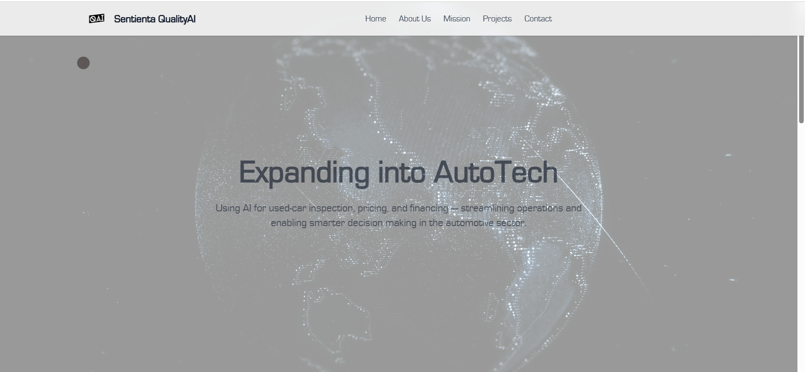
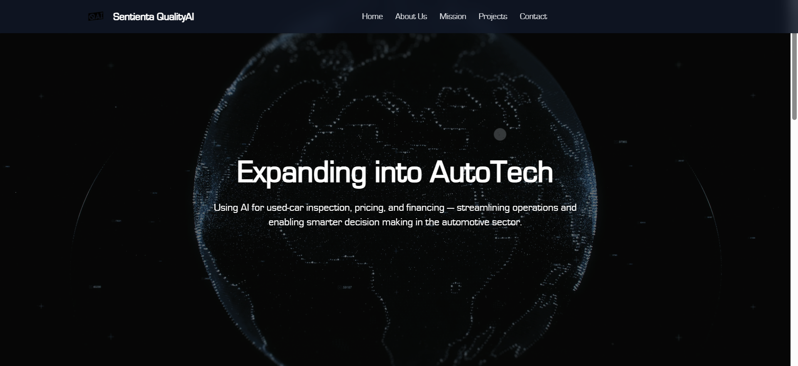

# SQAI Website

A modern, responsive, and animated website for **SQAI** — built using cutting-edge web technologies like **Next.js**, **React**, **Tailwind CSS**, and **Framer Motion**. The website features elegant animations, dark/light mode support, mobile responsiveness, and a smooth user experience.


## 🛠️ Tech Stack

- **Frontend Framework:** [Next.js](https://nextjs.org/)
- **JavaScript Library:** [React.js](https://react.dev/)
- **Styling:** [Tailwind CSS](https://tailwindcss.com/)
- **Animations:** [Framer Motion](https://www.framer.com/motion/)
- **Icons:** [Lucide React](https://lucide.dev/)
- **Image Optimization:** [Next/Image](https://nextjs.org/docs/api-reference/next/image)

---

## ✨ Features

- 🔥 **Fully Responsive Design**
- 🌗 **Dark / Light Mode**
- 📱 **Mobile Friendly Navigation Menu**
- 🎞 **Smooth Page & Section Animations using Framer Motion**
- 🌟 **Minimal, Clean & Modern UI**
- 🚀 **Optimized for Performance**
- 🗾️ **Optimized Images via Next.js Image component**
- 🧹 **Component-based architecture for scalability**

---

## 📂 Project Structure

```
SQAI-website/
│
├── app/               # Next.js app directory
│   ├── layout.jsx     # Main layout file (includes header, footer, global styles)
│   ├── page.jsx       # Main homepage
│   └── components/    # Reusable UI components (Header, Footer, Sections, etc.)
│
├── public/            # Static assets (images, icons, etc.)
│
├── styles/            # Global styles (if any custom CSS used)
│
├── package.json       # Project dependencies & scripts
├── tailwind.config.js # Tailwind CSS configuration
├── next.config.js     # Next.js configuration
└── README.md          # Project documentation
```

---

## 🚀 Getting Started

### 1️⃣ Clone the Repository

```bash
git clone https://github.com/harshitabisht05/SQAI-website.git
cd SQAI-website
```

### 2️⃣ Install Dependencies

Make sure you have **Node.js** and **npm** installed.

```bash
npm install
npm install framer-motion
npm install lucide-react
```

### 3️⃣ Run the Development Server

```bash
npm run dev
```

Visit: [http://localhost:3000](http://localhost:3000) to view the app in the browser.


---


## 📸 Screenshots

<!-- Add actual screenshots -->
| Light Mode | Dark Mode |
| ---------- | --------- |
|  |  |

---
